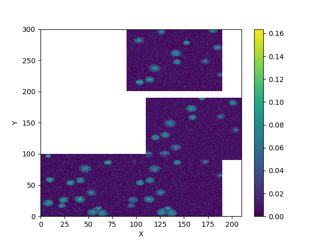

# bioviz_accessor's Documentation

[](https://github.com/ianhi/bioviz_accessor/raw/main/LICENSE)
[](https://pypi.org/project/bioviz_accessor)
[](https://python.org)
[](https://github.com/ianhi/bioviz_accessor/actions/workflows/ci.yml)
[](https://codecov.io/gh/ianhi/bioviz_accessor)


This repo provides an `xarray` [Accessor](https://docs.xarray.dev/en/stable/internals/extending-xarray.html) that helps with some biological vizualization task when using `xarray` when you data from a multidimensional acquisition stored in `xarray`.

## Install
```bash
pip install bioviz_accessor
```


optionally if you want the fake data functionality

```bash
pip install bioviz_access[fake]
```


## Image Stitching

When you are runing a microscopy experiment it can be helpful to compose all a large image containing all the fields of view. This package leverages `xarray`'s coords with `scikit-image` functions to provide a convientent stitching method that work even with overlapping images to create a large stitched image.

### Dims and Coords requirements

### Dims

In the future when there is proper support for OME-zarr in Xarray we will be able to leverage that standard metadata and have greater flexibility with dimension naming and where physical coordinates are stored. For now this library uses a custom(read: slightly brittle) convention following what is returned by [`aicsimageio.get_xarray_dask_stack`](https://allencellmodeling.github.io/aicsimageio/aicsimageio.html#aicsimageio.aics_image.AICSImage.get_xarray_dask_stack]) with a dimension order of `STCZYX` where `S` refers to "scenes" or different positions/FOV of the MDA. This means that you must have exactly 6 dimensions. Unused dimensions can have shape 1.

### Coords

`Xarray` does not allow dims with the same name (e.g. `Y`) to refer to different physical coordinates. So while two different Fields of View may have the same YX dimensions because they represent different physical regions in the same we cannot directly encode the lab-frame coordinates into xarray.  This will eventually be resolved with xarray support for ome-zarr, likely via `xarray-datatree`


As a workaround we can encode the shared physical extent of the FOVs in the `Y` and `X` dimensions, and the center of each FOV in two other dimensions `Sx` and `Sy` like so:

```python
XY_postion = np.array([
    (X1, Y1),
    (X2, Y2),
    ...
])

FOV_micron = 100 # if your image covered 100 micron of sample
img_pixels = (512, 512) # if you had a 512 x 512 pixel image.
data = xr.DataArray(
    images,
    dims = ("S", "T", "C", "Z", "Y", "X"),
    coords={
        "Sx": ("S", XY_positions[:, 0]),
        "Sy": ("S", XY_positions[:, 1]),
        "X": np.linspace(0, FOV_micron, img_pixels),
        "Y": np.linspace(0, FOV_micron, img_pixels),
    },
)
```

### Limitations

The interpolation of the final physical coordinates is not quite right, it leaves the images slightly squashed or stretched when the image extent gets large. However, this is still useful for taking a quick look while preparing a microscopy experiment.


### Example
```
import xarray as xr
import bioviz_accessor
from bioviz_accessor.example_data import generate_fake_overlap_data


data = generate_fake_overlap_data()
data.bviz.stitched(T=0, C=1, Z=1).plot.imshow()
```

which gives this image:




## Hyperslicing

This package also makes it easy to use [`mpl-interactions.hyperslicer`](https://mpl-interactions.readthedocs.io/en/stable/examples/hyperslicer.html) by providing the `bviz.hypersliced()` function.
